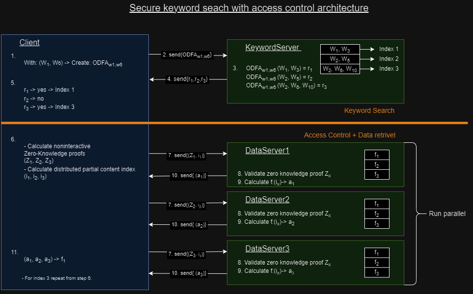

# Access Control for secure keyword search with access control

The aim of this project is to develop a protocol that facilitates a privacy-preserving keyword search, coupled with access control and data retrieval, all while ensuring security in a post-quantum context. This is based on the theoretical foundation in the work of our paper: [paper]()
The scope of this repository is to implement the access control component described within the publication.

The overall sheme of the paper is fundamentally visualised here:


The focus of our current project narrows down to the components shown below the orange line in the diagram, explicitly excluding the data retrieval segment. To realize the goals of access control within this framework, we combine advanced cryptographic techniques. These include Shamir's Secret Sharing, Distributed Point Functions (DPF), Learning With Errors (LWE), and Zero-Knowledge Proofs. The [How it works](#how-it-works) sections gives deeper insights into the different parts.

## Table of content

- [General Overview](#general-overview)
- [Structure of the Repository](#structure-of-the-repository)
- [Installation](#installation)
  - [Requirements](#requirements)
  - [Install GMP](#install-gmp)
  - [Install NTL](#install-ntl)
  - [Install json library](#install-json-library)
  - [Install boost::asio](#install-boostasio)
- [Usage](#usage)
  - [Compilation](#compilation)
  - [Execution](#execution)
- [How it Works](#how-it-works)
  - [Improvement Suggestion](#improvement-suggestion)
- [License](#license)
- [Contact Information](#contact-information)

## Structure of the repository

| folder/file                               | short description    |
|-------------------------------------------|----------------------|
| [DPF](DPF)                                | Taken from: [https://github.com/dkales/dpf-cpp?tab=readme-ov-file](https://github.com/dkales/dpf-cpp?tab=readme-ov-file)  |
| img                             | Images for the REAME.md |
| [Network](Network)                        | Code for network communication using boost::asio.    |
| [PACL](PACL)                              | Code for the PACL protocol (main contribution of the paper).     |
| [PVSS](PVSS)                              | Code for the PVSS/GHL+ using LWE cryptography (learning with erros).    |
| [SSSharing](SSSharing)                    | Code for the Sharmir Secret Sharing.     |
| [ZeroKNowledgeProver](Zeroknowledgeprover)| Rust code for the risc0 prover and verifier for the zero knowledge proves     |
| CMakeLists.txt                            | Build instructions for cmake.     |
| main.cpp                                  | Orchestrating the project.  |
| runMultipleBenchmarks.py                  | Python script to run the application with different settings (needs to be copied to the build folder).    |

## Installation

### Requirements

To run the project you need to have installed the following software and libraries:

- git
- cmake
- gcc
- gmp
- ntl
- json
- boost::asio

Additionally one need to install Rust together with the Risc0 prover. Detailed instructions can be found here: [ZeroKnowledgeProver/README.md](ZeroKnowledgeProver/README.md)

#### Install GMP

```bash
 sudo apt install libgmp3-dev
```

#### Install NTL

To install NTL for number theory follow the instructions here: [https://libntl.org/doc/tour-unix.html](https://libntl.org/doc/tour-unix.html)

Maybe these ones are better to find NTL with CMAKE?

```bash
sudo apt update -y
sudo apt install -y libntl-dev
```

#### Install json library

```bash
sudo apt update 
sudo apt install nlohmann-json3-dev
```

#### Install boost::asio

```bash
sudo apt update
sudo apt install libboost-all-dev
```

## Usage

### Compilation

After the zero knowledge proofs are pepared one can compile the c++ part of the project. The following lines show how to accomplish this.

```bash
mkdir build
cd build
cmake ..
make
```

### Execution

To execute a test run you have to pass commandline parameters.

- \<size of the secret\>: Size of the secret vector for each data entry.
- \<number of files\>: Maximum number of files in the whole database.
- \<reduncancy parameter\>: Redundancy parameter for the encoding/decoding of the PVSS/GHL+ encryption to determine the correct key.
- \<lwe parameter\>: A security parameter to improve the security of the LWE encryption in the PVSS/GHL+ part.
- \<delay\>: Time in seconds each thread has to setup its public keys before the next is initiated.

```bash
./AccessControl <size of secret> <number of files> <reduncancy parameter> <lwe parameter> <delay>
./AccessControl 128 1024 20 1 500
```

## How it works

### General overview

This implementation leverages Distributed Point Functions(DPF's), Shamir secret sharing(SSSharing) and post-quantum secure public verifiably secret sharing (PVSS/GHL+) as cryptographyic primitives. These algorithms, especially the PVSS, are used as modules and could be substituted by any other schemes providing the same functionality. Private access control lists (PACL) is the greater scheme which provides privacy in an access control mechanism.

The integration of DPF and SSS is pivotal for ensuring user anonymity, effectively preventing the server from correlating a submitted key with any specific database entry or identifying an individual user. Concurrently, the employment of PVSS/GHL+ provides resilience against quantum computing threats with a robust encryption mechanism that's future-proof.

In this project the 'main.cpp' can be seen as the master server, who orchestrates the initialisation of the asymmetric keys. Because our implementation runs on only one machine the master server also initialises the servers and the user as seperated threads, communicating over standard network protocols.

From a client-side perspective, the system incorporates DPF, SSS, PVSS and network communication capabilities. Similarly, the server architecture is predicated on these components, with the addition of PACL to privide private data access control.

The operational sequence begins with the master server initiating two data server threads, supplying them with essential inputs and public keys necessary for generating their PVSS/GHL+ public keys. This step is accompanied by the generation of zero-knowledge proofs to verify the integrity of the computations without revealing underlying values.

Subsequently, a user thread is spawned, receiving private keys and parameters from the master server for data access. The client then initialises DPF and SSSharing, establishes network connections with the data servers and proceeds to validate their zero-knowledge proofs.

Following this verification, the client constructs its zero-knowledge proof to affirm the correctness of its PVSS/GHL+ computations and the adherence to small-value constraints for LWE (Learning With Errors) encryption parameters. Upon dispatching this data to the servers, the user's role in access control concludes.

The servers then authenticate the user's proof, decrypt and decode the PVSS/GHL+ ciphertext and further decrypt the DPF values. Utilizing these decrypted entities, the servers execute PACL computations to determine the TAU_x values for each server. These TAU values are relayed back to the master server, which aggregates them. A resultant vector composed exclusively of zeros signifies a successful access control procedure. This approach exemplifies a architecture designed for ensuring data privacy and security in distributed systems, particularly in the face of evolving quantum computing capabilities.

### Improvement suggestion

This section serves as a list of things we think could improve the performance of the overall system or add functionality to better deploy and test the setup.

- optimize all NTL calculations by:
  - using multiple threads for calculations like:
    - PVSS decryption and decoding, TAU calculation
  - remove all unneccessary temporarily created objects [https://libntl.org/doc/tour-tips.html](https://libntl.org/doc/tour-tips.html)
- optimize and fine-tune the encryption and decryption of the PVSS/GHL+ to increase performance and the probablity of a successsfull granted access control

- use protobuf for communicating the values over the network to save overhead of JSON format
- outsource the server threads to different machines, decreasing the time to create the zero-knowledge proof every run
- DPF could be improved by using every bit for a different file and not an integer using 8 bit

- PVSS decode keys -> einmaliges erstellen der NTL vectoren und übergeben der positionen als temp und rechenobjekte
- PVSS decode keys -> nth part kann jeweils pro thread ausgeführt werden
- seperate the threads to 3 different maschines
- use protobuf for the network communication to be more efficient

## License

MIT wie DPF???

## Contact information

Theoretical background: Maryam Zarezadeh

Implementation: Hannes Bluemel
